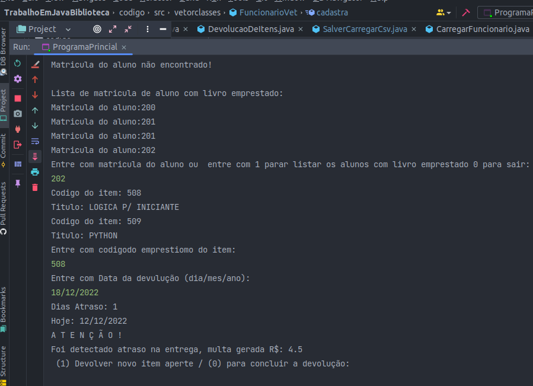
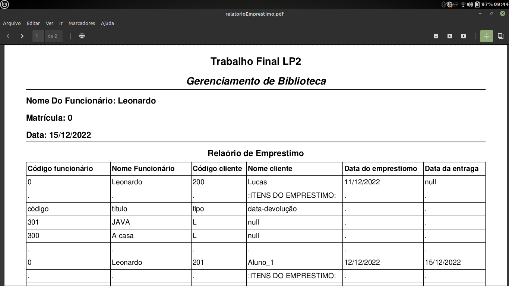
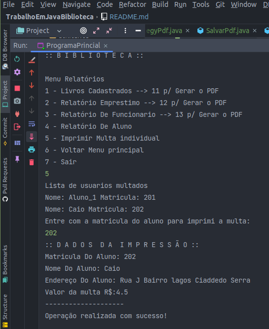

# Sistema de Gerenciamento de Biblioteca


### Descrição do problema
O projeto de programação é o desenvolvimento de uma versão eletrônica básica de um Sistema de
Gerenciamento de Biblioteca. Tal sistema tem por finalidade controlar entrada e saída de acervos,
controle de usuários, e emissão de relatórios gerenciais. Abaixo segue uma lista de requisitos e
especificações que devem ser seguidas no desenvolvimento do programa. Quaisquer questões não
contempladas por este documento devem ser levadas ao professor para esclarecimentos.
### Requisitos
O Sistema Gerencial de Biblioteca tem por objetivo o controle e organização de todo o acervo de
uma biblioteca. Tal organização envolve a entrada e a saída de acervos, bem como a emissão de
relatórios de gerência e controle, visando facilitar a administração da biblioteca..<br><br>
  O programa deve ser desenvolvido na linguagem Java, e a interface (comunicação com o usuário)
deve ser realizada pela entrada (teclado) e saída (tela) padrões. O uso de arquivo será feito para
armazenar os dados necessários para a execução das operações do sistema.<br><br>
O programa deve permitir algumas operações, tais como o levantamento total de acervo existente
na biblioteca emitido através de relatórios. O software permitirá ao bibliotecário (funcionário)
cadastrar acervos e clientes (aluno, professor, etc), efetuar empréstimos, devoluções e consultar
todo o acervo existente.<br><br>
O sistema para gerenciamento de biblioteca deverá conter cadastro de usuários, no qual dados serão
colhidos dos usuários, funcionários, itens (livros e periódicos) para possíveis empréstimos e
devoluções de itens. Para que um empréstimo de itens seja efetuado será necessário que o usuário
e os itens estejam devidamente cadastrados no sistema, lembrando que o cliente deverá estar sem
multas em seu registro. Caso o item esteja cadastrado, o empréstimo será efetuado. Logo após o
lançamento do empréstimo poderá gerar um relatório do empréstimo contendo a data de devolução.
O prazo para devolver o livro será de 5 dias.<br><br>
# Funcionalidades
### Cadastro de itens
Para cada item deve se informar o título, autor, editora, tipo e ano de publicação, e para cada item
podem ser cadastrados diversos exemplares, cada exemplar possui um código distinto.
### Cadastro de usuários
O sistema deve permitir cadastrar funcionários e usuários.
### Empréstimo de itens
O sistema deve fazer o empréstimo de itens para os usuários cadastrados na biblioteca. Se o usuário
possuir multa, o sistema deverá impedir o empréstimo.
### Autenticar Usuário
O sistema somente poderá ser usado por funcionários da biblioteca.
### Emitir Relatório
O sistema deverá emitir os seguintes relatórios:<br>
• Livros cadastrados;<br>
• Empréstimos realizados;<br>
• Funcionários cadastrados;<br>
• Alunos cadastrados;<br>
• Imprimir multa individual;<br>

### Devolução de itens
O Sistema solicita os dados necessários para realizar a devolução. Se a devolução aconteceu depois
do prazo, o valor da multa será calculado e apresentado para o usuário que poderá usar a opção
Relatório de Multa para imprimir a multa do aluno. O Sistema emitirá uma mensagem “Devolução
realizada com êxito” e salvará os dados da devolução.

### Formatos de entrada e saída
Os cadastros dos dados de alunos, livros, estantes, etc. são feitos em arquivos. Para o
processamento destes dados e geração dos relatórios desejados, os arquivos serão gravados para
um formato de texto simples com valores separados por vírgulas, conhecido como CSV (Comma
Separated Values). No entanto, para evitar conflito com representação de valores decimais (ex.: 8,9),
os dados serão exportados utilizando ponto-e-vírgula como separadores (ex.: Aluno;18127205;Jose
Alves;Rua 13 de maio,17, Centro, Vitória-ES;Administração;4,50 – representando que aluno José
Alves tem uma multa no valor de R$ 4,50).<br><br>
Para facilitar a leitura dos relatórios produzidos pelo programa, será feita a importação dos dados
dos relatórios do formato CSV para planilha eletrônica. Portanto, seu programa deve ser capaz, além
de ler dados neste formato, também gerar os relatórios em CSV<br><br>
É muito importante que o programa siga os padrões de formatação prescritos, pois do contrário pode
apresentar erro na leitura ou diferenças nos relatórios durante a correção dos trabalhos (vide Seção
4). Note que tanto os arquivos de entrada quanto os de saída possuem linhas de título que devem
ser levadas em consideração (ou seja, descartadas durante a leitura das planilhas de entrada e
inseridas durante a escrita dos relatórios de saída).

### Entrada de dados
Esta seção descreve os dados que estarão presentes em cada um dos arquivos de entrada e os
dados que devem estar presentes em cada um dos arquivos de saída (relatórios). Para saber como
estes dados serão formatados, verifique os arquivos de exemplo disponibilizados juntamente com
esta descrição.<br><br>
São cinco os arquivos de entrada de dados:<br>
• Planilha de alunos;<br>
• Planilha de funcionários;<br>
• Planilha de professores;<br>
• Planilha de livros e periódicos;<br>
• Planilha de empréstimos.<br><br>
Os nomes dos arquivos são especificados durante a execução do programa (vide Seção 3). Abaixo
encontra-se especificada a ordem que os dados devem aparecer em cada um destes arquivos:
#### Planilha de Aluno
***<matrícula>;< nome>;<endereço>;< curso>;< data-ingresso>;< multa>*** </br>
A matrícula é numérica (inteiro, 8 dígitos); nome, endereço e curso podem ser lidos como texto;<br>
as datas são informadas no formato dd/mm/aaaa; e o valor da multa é numérico (real).
#### Planilha de funcionários
***<matrícula>;< nome>;< endereço>;< data-ingresso>;< setor>;< senha>;< login>*** </br>
A matrícula é numérica (inteiro, 8 dígitos); nome, endereço, setor, login e senha podem ser lidos
como texto; a data será informada no formato dd/mm/aaaa.
#### Planilha de professores
***< matrícula>;< nome>;< endereço>;< data-ingresso>;< setor>*** </br>
A matrícula é numérica (inteiro, 8 dígitos); nome, endereço e setor podem ser lidos como texto;
a data será informada no formato dd/mm/aaaa.
#### Planilha de livros
***<código>;<autor(es)>;<título>;< editora>;< tipo>;< ano de
publicação>;< issn>*** </br>
A código é numérico (inteiro, 8 dígitos), autor (se houver mais de um, serão separados por
vírgula), título, editora e ISSN podem ser lidos como texto; tipo é um caractere, sendo ‘L’ para
livros e ‘P’ para periódicos; o ano de publicação é numérico (inteiro) informado no formato aaaa.
#### Planilha de periódicos
***<código>;< autor(es)>;< título>;< tipo>;< fator-de-impacto>;< issn>*** </br>
A código é numérico (inteiro, 8 dígitos), autor (se houver mais de um, serão separados por
vírgula), título e ISSN podem ser lidos como texto; tipo é um caractere, sendo ‘C’ para
conferências, ‘R’ para revistas e ‘P’ para periódicos; fator de impacto é numérico (real).
#### Planilha de empréstimos
***<código>;< matrícula-cliente>;< matrícula-funcionário>;< data-
empréstimo>;< data-devolução>*** </br>
O código e as matrículas são numéricos (inteiro, 8 dígitos); as datas serão informadas no formato
dd/mm/aaaa.
#### Planilha itens de empréstimo
***<código-item>;< código-empréstimo>;< código-livro>;< código-
periódico>;< data-devolução>*** </br>
O código e as matrículas são numéricos (inteiro, 8 dígitos); as datas serão informadas no formato
dd/mm/aaaa.
### Dicas de implementação
Lidos todos os dados, o programa deve criar objetos em memória representando as informações
contidas nos arquivos de entrada. Tais objetos devem estar ligados adequadamente, conforme as
associações entre as classes de objetos, observando os princípios da orientação a objetos.<br><br>
Com os dados em memória (representados pelos objetos), o programa deve executar as funções
previstas no sistema. Leitura de dados de arquivos, formatação, etc. são fontes comuns de erros e
exceções. Além disso, é possível que os dados das planilhas não estejam consistentes. Seu
programa deve tratar apenas os seguintes tipos de erro:<br>
- a) Erros de entrada e saída de dados como, por exemplo, o arquivo especificado não existir ou
o programa não ter permissão para ler ou escrever em um arquivo. Nestes casos, o programa
deve exibir a mensagem “Erro de I/O” (sem as aspas) e terminar sem produzir arquivos de
saída;
- b) Erro de formatação dos dados nos arquivos, ou seja, um valor formatado de forma incorreta
nos arquivos de entrada (ex.: encontrado caractere onde esperava-se um número), causando
erros de parsing dos dados. Nestes casos, o programa deve exibir a mensagem “Erro de
formatação” (sem as aspas) e terminar sem produzir arquivos de saída;
- c) Inconsistência nos dados, ou seja, não conformidade com a especificação dos arquivos de
entrada

### Critérios de avaliação
Os trabalhos serão avaliados em duas etapas:
- Avaliação objetiva, valendo 10 pontos;
- Avaliação subjetiva (entrevistas), valendo 10 pontos.<br>
A nota final do trabalho é a média aritmética simples entre as notas acima. Para a avaliação objetiva,
todo trabalho possui inicialmente nota 10 e sofre modificações nas situações descritas na tabela
abaixo:<BR>
Para avaliação subjetiva, novamente os trabalhos começam com nota 10 e perdem pontos (que
variam de acordo com a avaliação feita pelo professor) caso não estejam bem escritos ou
organizados. Critérios utilizados na avaliação subjetiva incluem (mas não estão limitados a):
- Uso dos princípios básicos de programação utilizando a linguagem Java, como declaração
de variáveis, estruturas de repetição e condicional, estruturas de dados homogêneas (vetores
e matrizes) e heterogêneas (classes), arquivos entre outros elementos da linguagem Java
estudados na disciplina de Algoritmo II;
- Legibilidade (nomes de variáveis bem escolhidos, código bem formatado, uso de comentários
quando necessário, etc.);
- Consistência (utilização de um mesmo padrão de código, sugere-se a convenção de código
do Java: https://www.oracle.com/technetwork/java/codeconvtoc-136057.html;
- Eficiência (sem exageros, tentar evitar grandes desperdícios de recursos);
- Uso eficaz da API Java;
- Se o aluno sabe responder questões formuladas pelo professor durante a entrevista sobre o
código-fonte escrito pela dupla.
- Se o aluno fez as postagens definidas para serem realizadas durante as aulas de orientação.
### Arvore De Arquivos E Diretorio ###
```
├── codigo.iml
└── src
├── classes
│   ├── Aluno.class
│   ├── Aluno.java
│   ├── Emprestimo.java
│   ├── Funcionario.java
│   ├── ItenDeEmprestimo.java
│   ├── Livro.java
│   ├── Periodico.java
│   ├── Pessoa.java
│   └── Professor.java
├── menu
│   ├── MenuCadastroDeusuario.java
│   ├── MenuPricipal.java
│   └── MenuRelatorio.java
├── ProgramaPrincial.java
├── utilitarios
│   ├── Base_Dados
│   │   ├── alunos.csv
│   │   ├── emprestimos.csv
│   │   ├── funcionarios.csv
│   │   ├── itenDeEmprestimos.csv
│   │   └── livros.csv
│   ├── BuscarClienteLivro.java
│   ├── CalculadoraDeData.java
│   ├── CarregarCsvVetor.java
│   ├── DevolucaoDeItens.java
│   ├── estrategies
│   │   └── carregarvetores
│   │       ├── CarregarAluno.java
│   │       ├── CarregarEmprestimo.java
│   │       ├── CarregarFuncionario.java
│   │       ├── Carregar.java
│   │       ├── CarregarLivro.java
│   │       └── Estrategy.java
│   ├── GerarRelatorio.java
│   ├── Login.java
│   ├── Relatorio
│   │   ├── relatorioAluno.csv
│   │   ├── relatorioEmprestomo.csv
│   │   ├── relatorioFuncionario.csv
│   │   └── relatorioLivros.csv
│   └── SalverCarregarCsv.java
└── vetorclasses
├── AlunoVet.java
├── EmprestimoVet.java
├── FuncionarioVet.java
├── ItenEmprestimoVet.java
├── LivroVet.java
├── PeriodicoVet.java
└── ProfessorVet.java
```
###  Tecnologia Utilizada No Desenvolvimento ###
- java se(Standard Edition) bibliotecas utilizadas
  - File
  -  FileWriter
  - PrintWrite
  - List
  - LocalDate
  - DateTimeFormatter
  - Duration
  - Lambda
  - stream
  - Tratando De Exceções
- [ Maven](https://maven.apache.org/)
- [ Itextpdf](https://itextpdf.com/)
###  Instalação ###
Utilizando Git:<br>
clone o diretório com comando abaixo na pasta de trabalho e abra utilizando sua IDE para rodar:
```
git clone https://github.com/ifeslopes/TrabalhoEmJavaBiblioteca.git
```
Baixando zip:<br>
Baixe zip e descompact pasta de trabalho e abra utilizando sua IDE para rodar:<br>
[Trabalho_Biblioteca.zip](https://github.com/ifeslopes/TrabalhoEmJavaBiblioteca/archive/refs/heads/main.zip)

Depaendencias do Itextpdf:
copie esse código para o arquivo Pom.xml do Mave
```
  <dependency>
            <groupId>br.com.caelum.stella</groupId>
            <artifactId>caelum-stella-core</artifactId>
            <version>2.1.2</version>
        </dependency>
        <dependency>
            <groupId>br.com.caelum.stella</groupId>
            <artifactId>caelum-stella-boleto</artifactId>
            <version>2.1.2</version>
        </dependency>
        <dependency>
            <groupId>com.itextpdf</groupId>
            <artifactId>itext7-core</artifactId>
            <version>${itext.version}</version>
            <type>pom</type>
        </dependency>
        <dependency>
            <groupId>org.slf4j</groupId>
            <artifactId>slf4j-jdk14</artifactId>
            <version>1.7.25</version>
        </dependency>
```
## Funcionalidades ##
### Cadastro de usuários ###


### Autenticar Usuário ###


### Cadastro de itens ###


### Empréstimo de itens ###


### Devolução de itens ###

### Emitir Relatório 

- Funcionários cadastrados CSV:

- Funcionários cadastrados PDF:

- Alunos cadastrados CSV:

- Livros cadastrados:CSV
 
- Livros cadastrados:PDF


- Empréstimos realizados: CSV

- Empréstimos realizados: PDF

- Imprimir multa individual:<br>


